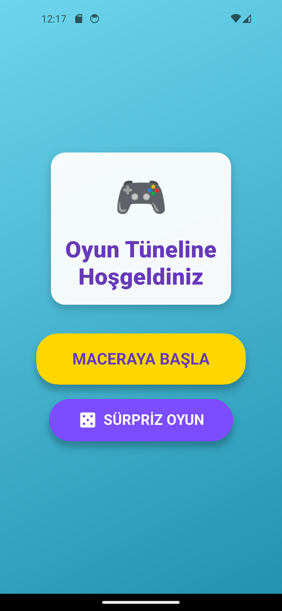
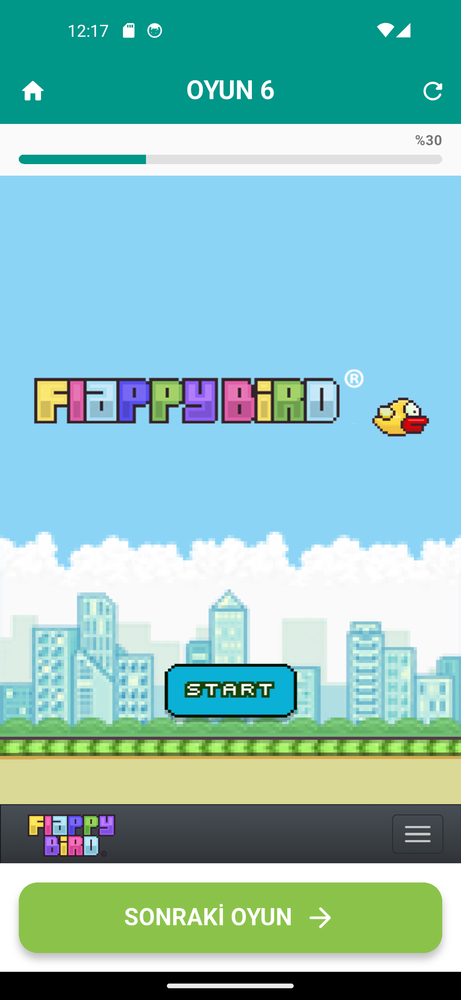
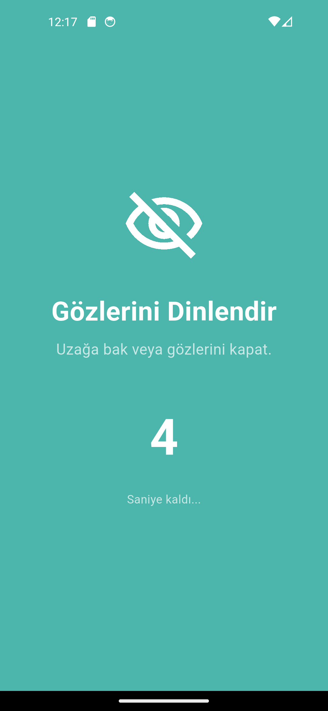
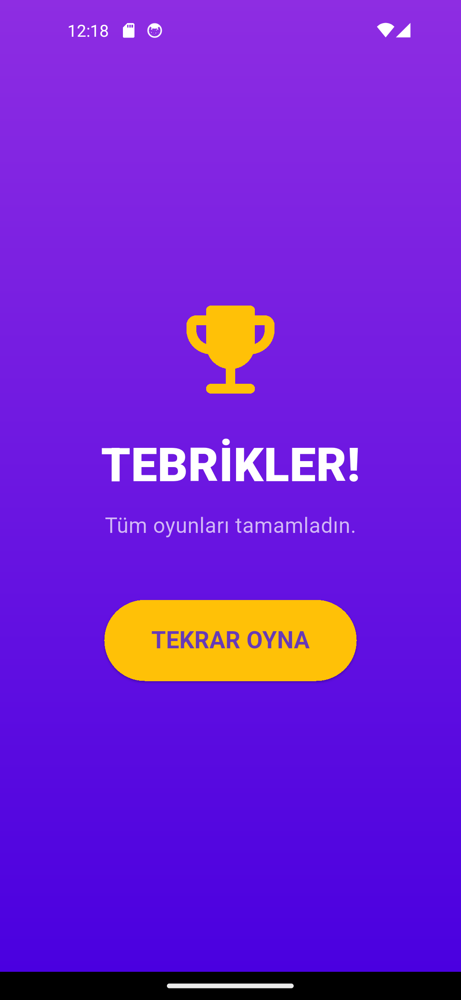

# 🎮 Renkli Zihin - Çocuklar İçin Oyun Tüneli

**Renkli Zihin**, çocuklar için özenle seçilmiş, şiddet içermeyen ve eğitici 20 farklı web tabanlı mini oyunu tek bir çatı altında toplayan, güvenli bir mobil oyun platformudur. 

Flutter ile geliştirilen bu proje; dinamik arayüzü, akıllı müzik yönetimi ve çocuk sağlığını düşünen "Göz Dinlendirme Sistemi" ile öne çıkmaktadır.

---

## 🌟 Öne Çıkan Özellikler

### 1. 🛡️ Güvenli ve Eğitici İçerik
* İçerisinde 2048, Hextris, Pacman, Müzik Yapıcı, Çizim Oyunları gibi **20 adet seçilmiş oyun** bulunur.
* Şiddet içeren veya karmaşık dil gerektiren oyunlar listeden çıkarılmıştır.

### 2. 👁️ Göz Dinlendirme Sistemi (Akıllı Mola)
* Çocukların ekran başında uzun süre kalmasını engellemek için **her 4 oyunda bir** sistem otomatik olarak devreye girer.
* **10 saniyelik zorunlu mola** ekranı açılır ve çocukları uzağa bakmaya teşvik eder.

### 3. 🎵 Akıllı Arka Plan Müziği
* Uygulama genelinde neşeli bir arka plan müziği çalar.
* **Otomatik Algılama:** Eğer açılan oyun müzik/ses tabanlı bir oyunsa (Örn: Piyano, Ritim oyunu), arka plan müziği **otomatik olarak susar**. Diğer oyunlarda tekrar başlar.

### 4. 🎨 Dinamik ve Zıt Renk Tasarımı
* Her oyunun kendine ait bir tema rengi vardır.
* **Görsel Zıtlık:** Üst menü (AppBar) oyunun rengini alırken, alt butonlar her zaman bu rengin **zıt tonunu** (kontrast) alarak canlı bir görünüm sunar.

### 5. 🎲 Sürpriz Oyun Modu
* Sırayla gitmek istemeyenler için ana ekranda **"Sürpriz Oyun"** butonu bulunur. Bu mod, listeden rastgele bir oyun seçer.

### 6. 📊 İlerleme Takibi
* Oyun esnasında üst kısımda kullanıcının kaçıncı oyunda olduğunu gösteren şık bir **İlerleme Çubuğu (Progress Bar)** bulunur.

---

## 🛠️ Kullanılan Teknolojiler ve Kütüphaneler

Bu proje **Flutter** kullanılarak geliştirilmiştir.

| Paket | Amaç |
|---|---|
| **Flutter SDK** | Ana geliştirme iskeleti. |
| **webview_flutter** | Web tabanlı oyunların uygulama içinde çalıştırılması. |
| **audioplayers** | Arka plan müziği ve ses efektleri yönetimi. |
| **Timer (Dart:async)** | Göz dinlendirme sayacı ve geri sayım mantığı. |
| **Random (Dart:math)** | Sürpriz oyun seçimi ve renk algoritmaları. |

---

## 📸 Ekran Görüntüleri

| Giriş Ekranı | Oyun Ekranı | Mola Ekranı | Bitiş Ekranı |
|---|---|---|---|
|  |  |  |  |

---

